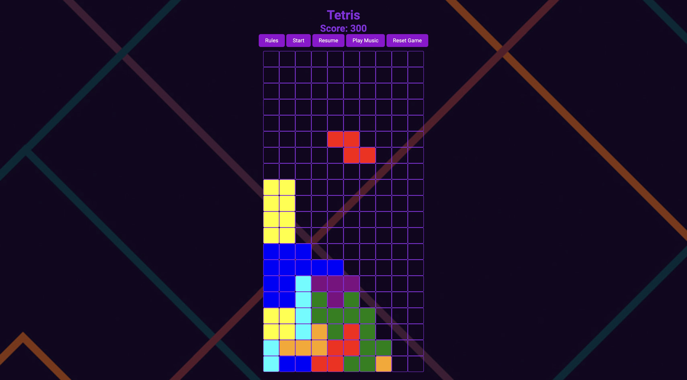

# Tetris

  

## :pencil: Descriptions:

This is a single-player Tetris game created using vanilla JavaScript, HTML, and CSS. The player uses arrow keys to move, drop, or rotate pieces. This is my second time creating a Tetris game. The first time was during college, where I had to create a Tetris game using Java for one of my computer science classes. I learned a lot from that experience, and I thought it would be pretty cool to create another Tetris game using JavaScript.

## :bust_in_silhouette: Attributions:

For the rotation of each pieces, I used the 2 dimensional rotation matrix to make my code cleaner. The documentation can be found [here](https://en.wikipedia.org/wiki/Rotation_matrix).

## 🎮 Getting Started:

You can access the game by clicking the link [here](https://debiddo618.github.io/tetris-javascript/).

## :blue_book: Wireframes:

The main game border is a simple box created with 10 columns and 20 rows of individual cells (all cells are 40 by 40). Here are some pieces reference I used to create each tetriminoes.

## :camera_flash: Game Images:

## :computer: Technologies Used:

## :satellite: Next Steps:

Here are some potential improvements to the project:

- Allow preview of the next piece
- Allow player to hold a piece
- Add more levels to the game
- Add speed up the game
- bonus points for completing multiple lines
- Compatibility with mobile devices
